# serial2ti83
A program for Arduino Uno that makes it possible to connect a TI-83 calculator to a computer

## Introduction
This program turns an Arduino Uno board into an adapter between a TI-83 graphing calculator and a computer. In order to use it upload `serial2ti83.ino` to an Arduino board using the standard Arduino IDE and connect the 2.5mm jack port on the bottom of TI-83 to Arduino according to the following table:

| Jack port     | Arduino       | 
|:-------------:|:-------------:|
| sleeve        | GND pin       |
| tip           | pin 2         |
| ring          | pin 3         | 
   
You can now run some linking program, e.g. **TiLP** and start exchanging data (upload programs, take screenshots, dump ROM, manage variables, etc.). In case of TiLP make sure to go to File->Change Device first and choose **GrayLink** cable and TI-83 calc.

_Optional_: before uploading `serial2ti83.ino` it is recommended to increase the size of hardware serial buffers to make the connection more reliable. Open `HardwareSerial.h` from you Arduino installation folder (usually `C:\Program Files (x86)\Arduino\hardware\arduino\avr\cores\arduino`) and change these 2 lines:

    #define SERIAL_TX_BUFFER_SIZE 64
    #define SERIAL_RX_BUFFER_SIZE 64

to:

    #define SERIAL_TX_BUFFER_SIZE 256
    #define SERIAL_RX_BUFFER_SIZE 256

## Putting it in a box
Here is an example of how you can put an Arduino board inside a box and attach a 3.5mm jack socket to the box to make a device that is convenient to use.

### List of required items
* Arduino Uno board (or clone)
* a plastic project box (search for "ABS Plastic Electronic Enclosure Project Box Black 103x64x40mm" on **Banggood**, it's about $3.5)

* 3.5mm panel mounted stereo jack socket (eBay, $0.99)

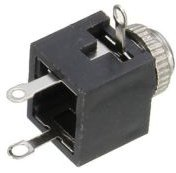

* nylon M3x10mm standoffs (eBay, $1.69 for 25 pieces)
* nylon M3x6mm philips screws (eBay, $1.79 for 25 pieces)
* 3.5mm to 2.5mm stereo jack cable (eBay, $0.99)
* some jumper cables
* basic tools (soldering iron, philips screwdriver, dremel tool, drill, files, etc.)

### Assembling the device

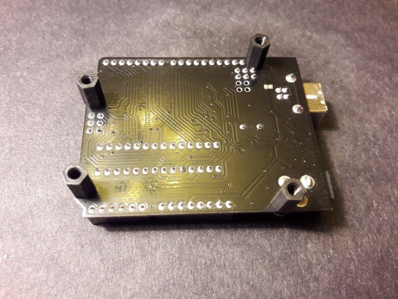

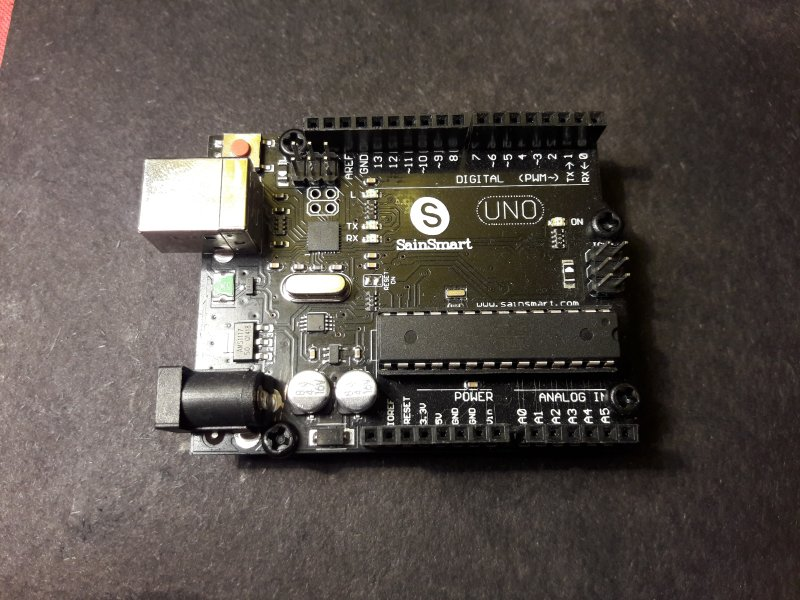

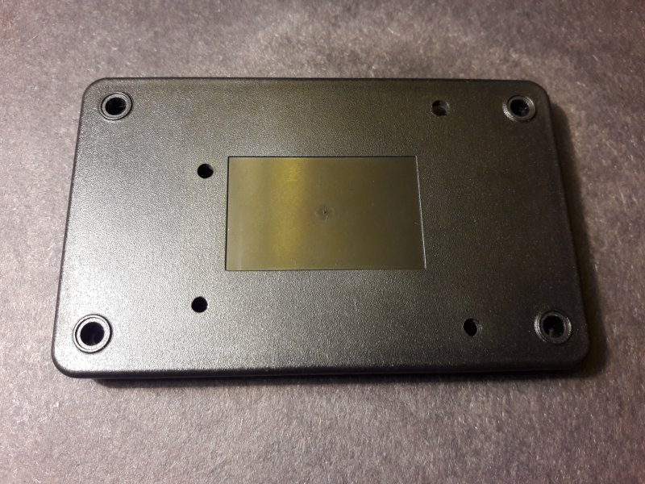

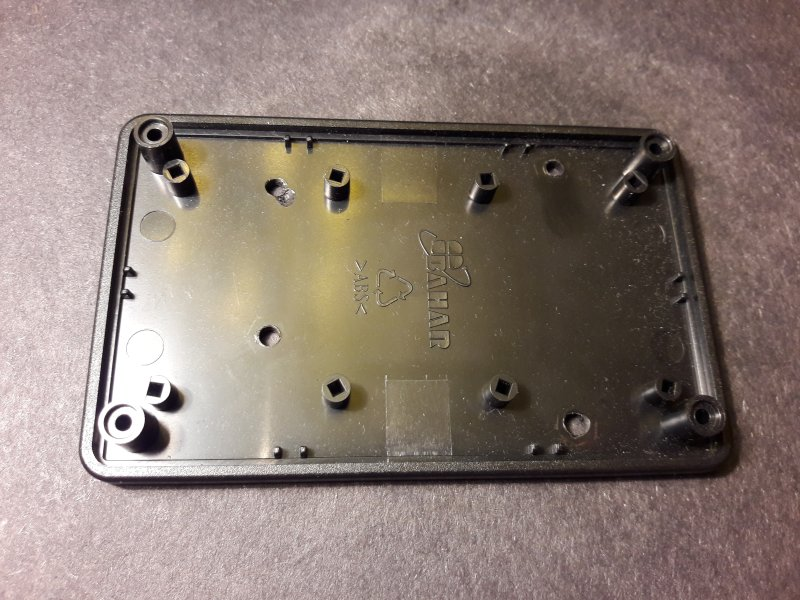

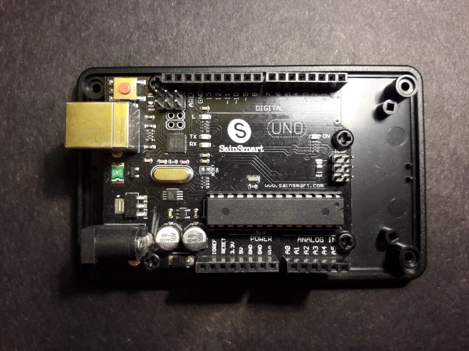

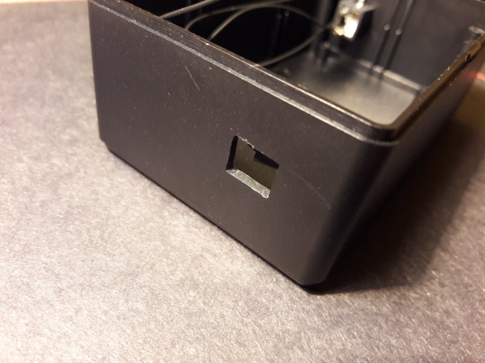

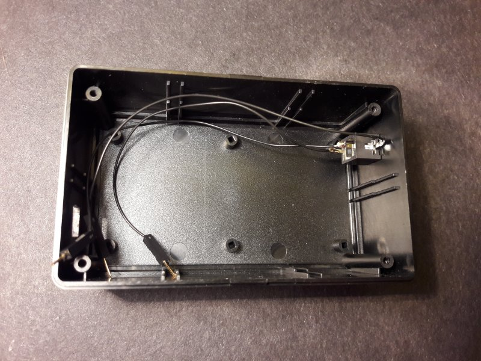

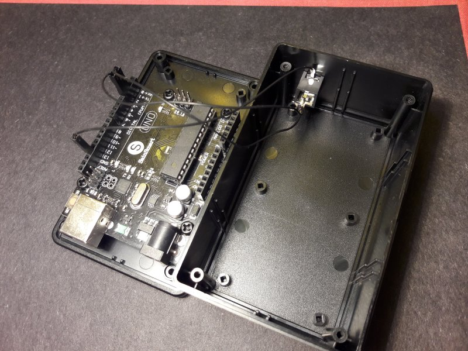

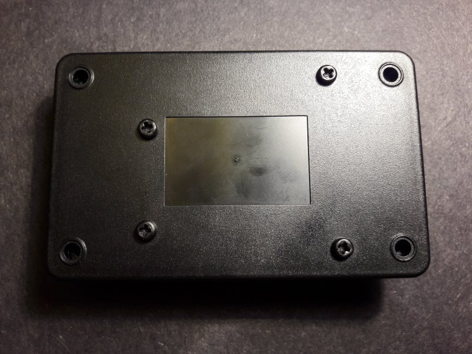

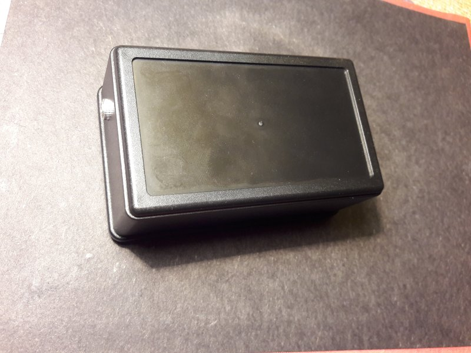
